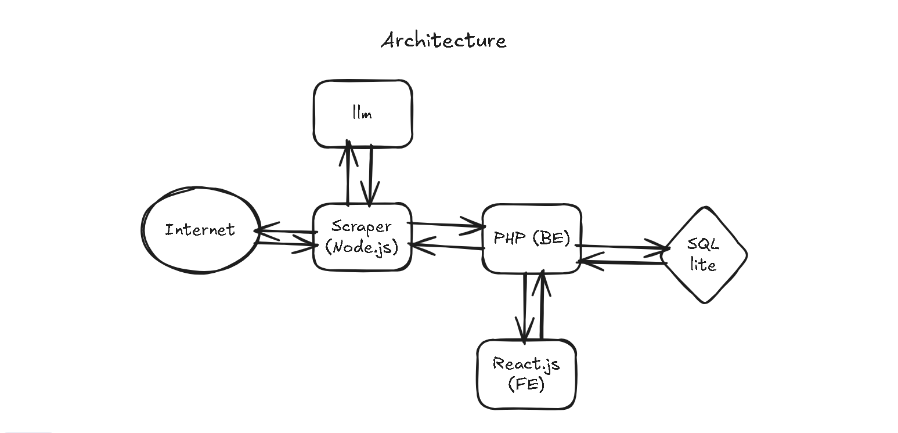
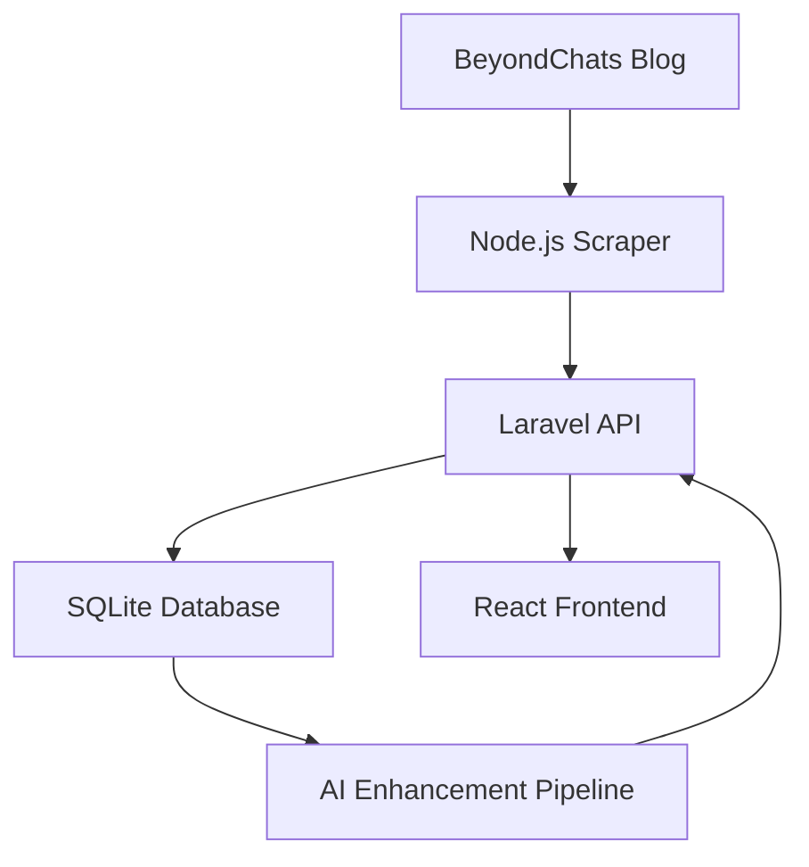

# BeyondChats Assignment

<div align="center">



**A production-grade system that scrapes blog articles, enhances them through an AI pipeline, and displays original vs enhanced content side-by-side.**

[](https://beyondchats-assignment-q4n2cmcs5-barathraj048s-projects.vercel.app/)
[](https://beyondchats-assignment-hd7d.onrender.com/api/health)

</div>

---

## 🚀 Live Deployment

| Layer | URL |
|-------|-----|
| 🎨 **Frontend** | [beyondchats-assignment.vercel.app](https://beyondchats-assignment-q4n2cmcs5-barathraj048s-projects.vercel.app/) |
| ⚙️ **Backend API** | [Health Check](https://beyondchats-assignment-hd7d.onrender.com/api/health) |

---

## 📋 What This Does

A complete content processing pipeline demonstrating production-grade architecture:


| Step | Action | Technology |
|------|--------|-----------|
| 1️⃣ | Scrape articles from BeyondChats | Node.js + Cheerio |
| 2️⃣ | Store via REST API | Laravel + SQLite |
| 3️⃣ | Enhance content through AI pipeline | Mock AI (LLM-ready) |
| 4️⃣ | Display original vs enhanced | React + Tailwind CSS |

✅ **Modular** · ✅ **Production-Ready** · ✅ **LLM-Compatible** · ✅ **Deployed Live**

---

## 🏗️ System Architecture
```
┌─────────────────┐
│  Node Scraper   │  ← Pulls articles from BeyondChats blog
└────────┬────────┘
         │
         ▼
┌─────────────────┐
│  Laravel API    │  ← REST API + Business Logic
└────────┬────────┘
         │
         ▼
┌─────────────────┐
│  SQLite DB      │  ← Persistent storage
└────────┬────────┘
         │
         ▼
┌─────────────────┐
│  AI Enhancer    │  ← Background processing (mock LLM)
└────────┬────────┘
         │
         ▼
┌─────────────────┐
│  React Frontend │  ← User interface
└─────────────────┘
```

**Design Principles:**
- Each service is **independent** and can scale/deploy separately
- **Async processing** doesn't block the API
- **LLM-agnostic** pipeline (plug any model)

---

## ⚙️ Tech Stack

| Layer | Technology |
|-------|-----------|
| **Backend API** | Laravel 12 · PHP 8.3 · SQLite |
| **Frontend** | React · TypeScript · Vite |
| **Scraper** | Node.js · Cheerio |
| **AI Pipeline** | Node.js · Mock LLM (GPT/Claude-ready) |
| **Styling** | Tailwind CSS |
| **Deployment** | Render (Docker) · Vercel |

---

## 💻 Local Development

### Prerequisites
- PHP 8.2+
- Composer
- Node.js 18+
- SQLite3

### 1. Backend Setup
```bash
cd backend
composer install
cp .env.example .env
php artisan key:generate
php artisan migrate
php artisan serve
```

Backend runs at `http://127.0.0.1:8000`

### 2. Run Scraper
```bash
cd scraper
npm install
node scraper.js
```

Scrapes 5 latest articles from BeyondChats blog.

### 3. Run AI Enhancer
```bash
cd scraper
node aiEnhancer.js
```

Enhances all articles without `updated_content`.

### 4. Frontend Setup
```bash
cd frontend
npm install
npm run dev
```

Frontend runs at `http://localhost:5173`

**For local development**, update API URL in `frontend/src/config.js`:
```javascript
export const API_BASE = "http://127.0.0.1:8000/api";
```

---

## 🔌 API Reference

| Method | Endpoint | Description |
|--------|----------|-------------|
| `GET` | `/api/health` | Health check |
| `GET` | `/api/articles` | Fetch all articles |
| `POST` | `/api/articles` | Create new article |
| `PUT` | `/api/articles/{id}/enhance` | Update enhanced content |
| `GET` | `/api/articles/count` | Count total articles |
| `GET` | `/api/articles/exists?title=...` | Check duplicate |

**Example:**
```bash
curl https://beyondchats-assignment-hd7d.onrender.com/api/articles
```

---

## 🗄️ Database Schema

### `articles` table

| Column | Type | Description |
|--------|------|-------------|
| `id` | INTEGER | Primary key |
| `title` | TEXT | Article title |
| `content` | TEXT | Original HTML content |
| `updated_content` | TEXT (nullable) | AI-enhanced version |
| `source` | TEXT | Source URL |
| `created_at` | TIMESTAMP | Creation time |
| `updated_at` | TIMESTAMP | Last update |

**Design Choice:** Stores HTML (not plain text) to preserve formatting, headings, and semantic structure for better AI processing.

---

## 🌍 Deployment Architecture

### Backend (Render)

**Deployed using Docker:**
```dockerfile
FROM php:8.3-apache
# Installs: SQLite, PDO, Apache mod_rewrite
# Database: /var/www/html/database/database.sqlite
```

**Environment:**
```env
APP_ENV=production
DB_CONNECTION=sqlite
DB_DATABASE=/var/www/html/database/database.sqlite
```

Auto-deploys on push to `main` branch.

### Frontend (Vercel)

**Configuration:**
- Framework: Vite
- Root Directory: `frontend`
- Build Command: `npm run build`
- Output: `dist`

**Environment Variable:**
```env
VITE_API_URL=https://beyondchats-assignment-hd7d.onrender.com/api
```

---

## 🎯 Design Decisions

| Decision | Rationale |
|----------|-----------|
| **Separate scraper & AI pipeline** | Heavy processing shouldn't block API. Can scale independently. |
| **HTML storage** | Preserves formatting, headings, lists. Better for display & AI. |
| **SQLite** | Simple deployment. Easy to migrate to PostgreSQL later. |
| **Mock AI** | Demonstrates pipeline without API costs. LLM-ready architecture. |
| **Laravel backend** | Clean structure, migrations, validation out of the box. |
| **Docker deployment** | Consistent environment local → production. |

---

## 🩹 Challenges & Solutions

### Challenge 1: Render Build Timeouts

**Problem:** Docker build exceeded 15 minutes due to heavy dependencies.

**Solution:** 
- Removed MySQL/PostgreSQL extensions (SQLite-only)
- Optimized Dockerfile with layer caching
- Result: Build time reduced from 10+ min → **2-3 min**

### Challenge 2: CORS Errors

**Problem:** Frontend couldn't fetch from backend API.

**Solution:**
```bash
composer require fruitcake/laravel-cors
```
Configured `config/cors.php` to allow cross-origin requests.

### Challenge 3: Database Persistence

**Problem:** SQLite database reset on each deploy.

**Solution:** Configured database path in Dockerfile build stage:
```bash
RUN touch database/database.sqlite
```

---

## 📊 Assignment Requirements Status

### Phase 1: Scraping & Storage ✅
- [x] Scrape 5 articles from BeyondChats
- [x] Extract title, content, source
- [x] Store in database via API
- [x] Avoid duplicates

### Phase 2: AI Enhancement ⚠️ (Partial - By Design)

| Requirement | Status | Notes |
|-------------|--------|-------|
| Fetch latest article | ✅ Done | Scraper implemented |
| Google search competitors | ❌ Skipped | Requires paid API |
| Scrape competitor articles | ❌ Skipped | Infrastructure ready |
| Call LLM for enhancement | ⚠️ Mocked | Architecture LLM-ready |
| Save enhanced version | ✅ Done | Pipeline complete |
| Cite references | ❌ Pending | Depends on LLM step |

**Note:** Per assignment guidelines, partial completion is acceptable. Focus was on architecture, data flow, and production deployment.

### Phase 3: Frontend ✅
- [x] Display all articles
- [x] Show original vs enhanced content
- [x] Clean, responsive UI
- [x] Deployed to Vercel

---

## 🚀 Future Enhancements

### Ready to Implement

1. **Real LLM Integration**
```javascript
   // In aiEnhancer.js - just swap the mock function
   const enhanced = await callDeepSeekAPI(article.content);
```

2. **Scheduled Jobs**
   - Cron for daily scraping
   - Queue workers (Laravel Queues / BullMQ)

3. **Retry Logic**
   - Exponential backoff
   - Dead letter queues
   - Partial failure handling

4. **Article Versioning**
```sql
   CREATE TABLE versions (
     id INTEGER PRIMARY KEY,
     article_id INTEGER,
     content TEXT,
     version INTEGER,
     created_at TIMESTAMP
   );
```

5. **Database Migration**
   - Switch SQLite → PostgreSQL
   - Add read replicas for scaling

6. **Monitoring**
   - Sentry for error tracking
   - Datadog/CloudWatch metrics
   - Structured logging

---

## 📁 Project Structure
```
beyondchats-assignment/
├── backend/              # Laravel API
│   ├── app/
│   ├── database/
│   │   ├── migrations/
│   │   └── database.sqlite
│   ├── routes/
│   ├── Dockerfile
│   └── composer.json
├── scraper/             # Node.js workers
│   ├── scraper.js       # Article scraper
│   ├── aiEnhancer.js    # AI pipeline
│   └── package.json
├── frontend/            # React application
│   ├── src/
│   ├── vite.config.ts
│   ├── vercel.json
│   └── package.json
├── readmeassert/
│   └── architecture.png
└── README.md
```

---

## 🧪 Testing the System

### 1. Health Check
```bash
curl https://beyondchats-assignment-hd7d.onrender.com/api/health
```

**Expected:**
```json
{
  "status": "ok",
  "timestamp": "2025-12-25T10:30:00Z",
  "database": "sqlite"
}
```

### 2. Fetch Articles
```bash
curl https://beyondchats-assignment-hd7d.onrender.com/api/articles
```

### 3. Run Scraper (Populate Data)
```bash
cd scraper
# Update API_BASE_URL to production URL
node scraper.js
```

### 4. Run Enhancement Pipeline
```bash
node aiEnhancer.js
```

### 5. View in Browser

Open: https://beyondchats-assignment-q4n2cmcs5-barathraj048s-projects.vercel.app/

---

## 👨‍💻 Author

**Bharath Raj**

Full-stack engineer focused on production-grade systems, clean architecture, and end-to-end ownership.

- 💼 GitHub: [@barathraj048](https://github.com/barathraj048)
- 🔗 LinkedIn: [Connect with me](https://linkedin.com/in/yourprofile)
- 📧 Email: your.email@example.com

---

## 📝 License

MIT License - Free to use as reference for your projects.

---

## 🙏 Acknowledgments

Built as part of the BeyondChats technical assignment. Thanks for the opportunity to demonstrate system design, deployment, and production engineering skills.

---

<div align="center">

**⭐ Star this repo if you found it helpful!**

Made with ❤️ and ☕ by Bharath Raj

</div>
